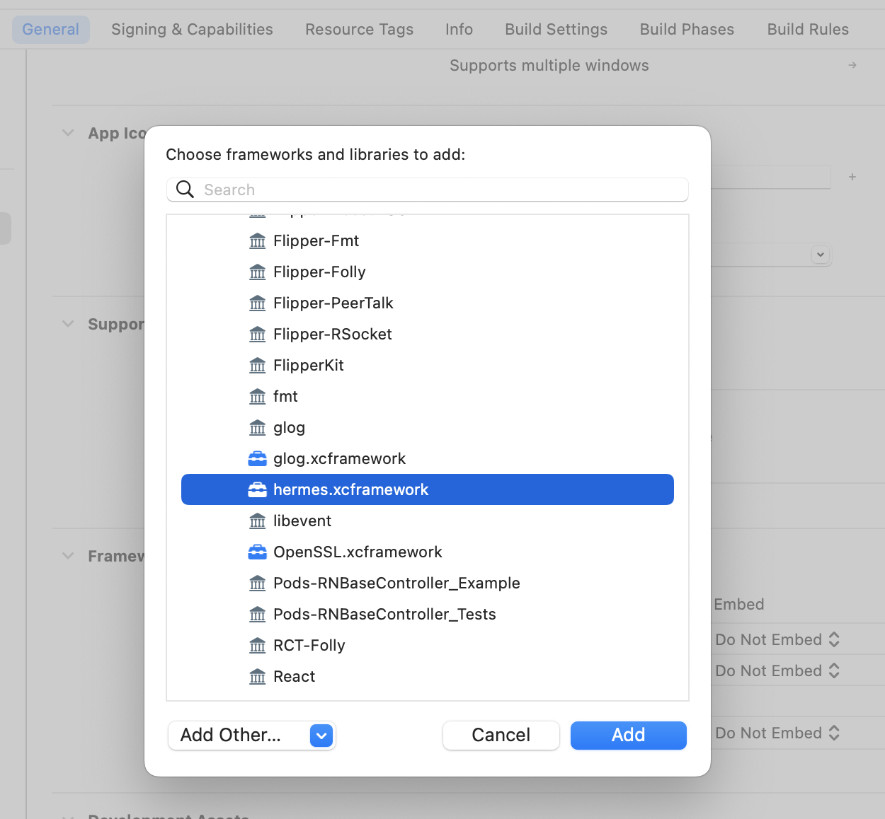

# RNBaseController

[](https://travis-ci.org/richiezhl/RNBaseController)
[](https://cocoapods.org/pods/RNBaseController)
[](https://cocoapods.org/pods/RNBaseController)
[](https://cocoapods.org/pods/RNBaseController)

## Example

To run the example project, clone the repo, and run `pod install` from the Example directory first.

## Requirements

## Installation

RNBaseController is available through [CocoaPods](https://cocoapods.org). To install
it, simply add the following line to your Podfile:

```ruby
pod 'RNBaseController'
```

## version
```
0.1.x 支持非新架构的React Native版本
>= 0.2.0 支持新架构的React Native版本
```

React Native 基础控制器
在 Pofile里加入以下代码
```
source 'https://github.com/RichieZhl/Spec.git'
source 'https://github.com/CocoaPods/Specs.git'
```

旧架构的版本请添加如下
```
target 'xxx' do
  pod 'React', '0.64.x'
end
```

新架构的版本请添加如下
```
`curl -O https://raw.githubusercontent.com/RichieZhl/RNBaseController/master/react_native_pods.rb`
require_relative './react_native_pods'

target 'xxx' do
  use_react_native!(
    :react_version => "0.70.0",
    :flipperkit_version => '0.125.0'
  )
  post_install do |installer|
    react_native_post_install(installer)
  end
end
```

其中react_native_pods是git里的react_native_pods.rb

并在主工程中引入hermes.xcframework



## Author

richiezhl, lylaut@163.com

## License

RNBaseController is available under the MIT license. See the LICENSE file for more info.
